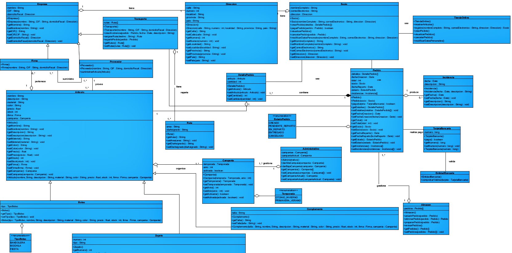

## Índice

- [Enunciado](#enunciado)
- [Ejercicios](#ejercicios)
  - [Ejercicio 1](#ejercicio-1)
  - [Ejercicio 2](#ejercicio-2)
  - [Ejercicio 3](#ejercicio-3)
  - [Ejercicio 4](#ejercicio-4)
  - [Ejercicio 5](#ejercicio-5)
  - [Ejercicio 6](#ejercicio-6)
  - [Ejercicio 7](#ejercicio-7)
  - [Ejercicio 8](#ejercicio-8)
- [Clases](#clases)
  - [Clase Socio](#clase-socio)
  - [Clase TiendaOnline](#clase-tiendaonline)
  - [Clase Articulo](#clase-articulo)
  - [Clase Zapato](#clase-zapato)
  - [Clase Bolso](#clase-bolso)
  - [Clase Complemento](#clase-complemento)
  - [Clase Campaña](#clase-campaña)
  - [Clase Administrativo](#clase-administrativo)
  - [Clase Dirección](#clase-dirección)
  - [Clase Empresa](#clase-empresa)
  - [Clase Firma](#clase-firma)
  - [Clase Transporte](#clase-transporte)
  - [Clase Ruta](#clase-ruta)
  - [Clase Pedido](#clase-pedido)
  - [Clase DetallePedido](#clase-detallepedido)
  - [Clase EntidadBancaria](#clase-entidadbancaria)
  - [Clase Incidencia](#clase-incidencia)
  - [Clase Almacén](#clase-almacén)
- [Repositorio](#repositorio)

## Enunciado

Desde hace mucho tiempo Ada no compra sus zapatos, botas, bolsos y otros artículos de piel en otro sitio que no sea "El tacón de oro". Conoce a los dueños de esta antigua zapatería desde hace tiempo y sabe que la nueva generación está muy interesada en expandir el negocio. Después de abrir varias sucursales, en diferentes puntos de la ciudad, y de otros lugares, opinan que el siguiente paso es la venta por Internet. Tienen muy clara su idea, poner los artículos de temporada (son los que están disponibles en almacén) a la venta, en forma de campañas. Mientras dure una campaña se podrán visualizar los artículos a la venta y hacer pedidos de los mismos, siempre y cuando se sea socio. El administrativo será el encargado de abrir y cerrar las campañas, y habrá un empleado de almacén que se encargue de servir los productos.

Descripción exacta del problema: “El tacón de oro”

Los usuarios del sistema navegan por la web para ver los artículos, zapatos, bolsos y complementos que se venden en la tienda. De los artículos nos interesa su nombre, descripción, material, color, precio y stock. De los zapatos nos interesa su número y el tipo. De los bolsos nos interesa su tipo (bandolera, mochila, fiesta). De los complementos (cinturones y guantes) su talla.

Los artículos se organizan por campañas para cada temporada (primavera/verano y otoño/invierno) de cada año. 

Los artículos son de fabricación propia, pero, opcionalmente, pueden venderse artículos de otras firmas. De las firmas nos interesa saber su nombre, CIF y domicilio fiscal. La venta de artículos de firma se realiza a través de proveedores, de forma que un proveedor puede llevar varios artículos de diferentes firmas, y una firma puede ser suministrada por más de un proveedor. Los artículos pertenecen a una firma solamente. De los proveedores debemos conocer su nombre, CIF, y domicilio fiscal.

Los usuarios pueden registrarse en el sitio web para hacerse socios. Cuando un usuario se hace socio debe proporcionar los siguientes datos: nombre completo, correo electrónico y dirección.

Los socios pueden hacer pedidos de los artículos. Un pedido está formado por un conjunto de detalles de pedido que son parejas formadas por artículo y la cantidad. De los pedidos interesa saber la fecha en la que se realizó y cuanto debe pagar el socio en total. El pago se hace a través tarjeta bancaria, cuando se va a pagar una entidad bancaria comprueba la validez de la tarjeta. De la tarjeta interesa conocer el número.

Las campañas son gestionadas por el administrativo de la tienda que se encargará de dar de baja la campaña anterior y dar de alta la nueva siempre que no haya ningún pedido pendiente de cumplimentar.

Existe un empleado de almacén que revisa los pedidos a diario y los cumplimenta. Esto consiste en recopilar los artículos que aparecen en el pedido y empaquetarlos. Cuando el paquete está listo se pasa al almacén a la espera de ser repartido. Del reparto se encarga una empresa de transportes que tiene varias rutas preestablecidas. Según el destino del paquete (la dirección del socio) se asigna a una u otra ruta. De la empresa de transportes se debe conocer su nombre, CIF y domicilio fiscal. Las rutas tienen un área de influencia que determina los destinos, y unos días de reparto asignados. Se debe conocer la fecha en la que se reparte el pedido. Si se produce alguna incidencia durante el reparto de algún pedido se almacena la fecha en la que se ha producido y una descripción.

Los socios pueden visualizar sus pedidos y cancelarlos siempre y cuando no hayan sido cumplimentados por el empleado de almacén. Así mismo puede modificar sus datos personales.

Acrónimo: Código de Identificación Fiscal

Tu tarea consiste en elaborar el diagrama de clases y la documentación para el análisis de una aplicación que implemente la venta por internet de la zapatería con la aplicación Visual Paradigm. Debido a las restricciones de la aplicación con el tiempo de evaluación, no es obligatorio generar el código de la aplicación, pero si debes importar el proyecto creado VP-UML en un proyecto de NetBeans. Para documentar el proceso deberás entregar un documento de texto con los siguientes puntos:

### EJERCICIOS 

#### EJERCICIO 1
Extracción de los sustantivos en la descripción del problema.

Usuarios - Sistema - Web - Artículos - Zapatos - Bolsos - Complementos - Nombre - Descripción - Material - Color - Precio - Stock - Número - Tipo - Campañas - Temporada - Primavera/verano - Otoño/invierno - Fabricación propia - Firma - CIF - Domicilio fiscal - Proveedores - Correo electrónico - Dirección - Pedidos - Detalles de pedido - Cantidad - Fecha - Pago - Tarjeta bancaria - Entidad bancaria - Número de tarjeta - Administrativo - Baja - Alta - Empleado de almacén - Paquete - Reparto - Empresa de transportes - Rutas - Área de influencia - Destinos - Días de reparto - Incidencia - Modificación - Datos personales

#### EJERCICIO 2
Selección de sustantivos como objetos/clases del sistema.

Usuario - Artículo - Zapato - Bolso - Complemento - Campaña - Temporada - Fabricación - Firma - Proveedor - Pedido - DetallePedido - TarjetaBancaria - EntidadBancaria - Administrativo - EmpleadoAlmacén - Paquete - Reparto - EmpresaTransportes - Ruta - Incidencia

#### EJERCICIO 3
Obtención de los atributos de los objetos.

| Entidad           | Atributos                                  |
|-------------------|--------------------------------------------|
| Socio             | nombreCompleto, correoElectronico, direccion |
| Articulo          | nombre, descripcion, material, color, precio, stock |
| Zapato            | numero, tipo                               |
| Bolso             | tipo                                       |
| Complemento       | talla                                      |
| Campaña           | temporada, año                             |
| Firma             | nombre, CIF, domicilioFiscal              |
| Proveedor         | nombre, CIF, domicilioFiscal              |
| Pedido            | fecha, totalPagar                          |
| Almacén           | pedidosPendientes                          |
| Transporte        | nombre, CIF, domicilioFiscal              |

#### EJERCICIO 4
Obtención de los métodos.

| Entidad           | Casos de uso                              | Descripción                            |
|-------------------|-------------------------------------------|----------------------------------------|
| Socio             | crearPedido(), pagarPedido(), visualizarPedidos(), cancelarPedido(), modificarDatosPersonales() | Permite al socio realizar un pedido de artículos, pagar un pedido de artículos, visualizar sus pedidos, cancelar un pedido pendiente, y modificar sus datos personales respectivamente |
| TiendaOnline      | mostrarArticulos(), registro(), crearPedido(), visualizarPedidos(), cancelarPedido(), modificarDatosPersonales() | Muestra los artículos de la tienda, permite a un usuario registrarse y convertirse en un socio, realizar un pedido de artículos, visualizar sus pedidos, cancelar un pedido pendiente, y modificar sus datos personales respectivamente |
| Administrativo    | darAltaCampaña(), darBajaCampaña()       | Permite dar de alta y baja una campaña |
| Proveedor         | suministrarArticulo()                     | Permite al proveedor suministrar artículos a la tienda |
| Tarjeta           | pago()                                    | Permite hacer un pago con la tarjeta |
| Almacén           | revisarPedidos(), prepararPedido()        | Permite al empleado revisar los pedidos pendientes y preparar los artículos de un pedido respectivamente |
| Transporte        | asignarRuta(), crearIncidencia(), repartirPedido() | Permite asignar una ruta de reparto a un pedido, registrar una incidencia durante el reparto de un pedido, y empezar a repartir un pedido respectivamente |

#### EJERCICIO 5
Obtención de las relaciones.

| Entidad           | Relación       | Entidad 2        | Tipo de relación |
|-------------------|----------------|------------------|------------------|
| Empresa           | tiene          | Dirección        | Composición      |
| Empresa           | tiene          | Socio            | Agregación       |
| Empresa           | tiene          | TiendaOnline     | Composición      |
| Articulo          | es parte de    | Pedido           | Agregación       |
| Zapato            | es tipo de     | Articulo         | Jerarquía        |
| Bolso             | es tipo de     | Articulo         | Jerarquía        |
| Complemento       | es tipo de     | Articulo         | Jerarquía        |
| Empresa           | pertenece a    | Campaña          | Asociación       |
| Empresa           | tiene          | Administrativo   | Agregación       |
| Firma             | es proveedor de| Articulo         | Asociación       |
| Proveedor         | suministra     | Articulo         | Asociación       |
| Transporte        | reparte        | Pedido           | Asociación       |
| Transporte        | tiene          | Ruta             | Composición      |
| Socio             | realiza        | Pedido           | Asociación       |
| Pedido            | tiene          | DetallePedido    | Agregación       |
| EntidadBancaria   | realiza        | Pago             | Asociación       |
| Pedido            | tiene          | Incidencia       | Agregación       |
| Almacén           | gestiona       | Pedido           | Asociación       |

#### EJERCICIO 6
Añadir getters, setters y constructores.

Entidad           | Atributo          | Getter                   | Setter
------------------|-------------------|--------------------------|----------------------------
Socio             | nombreCompleto    | getNombreCompleto()      | setNombreCompleto(nombreCompleto)
Socio             | correoElectronico | getCorreoElectronico()   | setCorreoElectronico(correoElectronico)
Socio             | direccion         | getDireccion()           | setDireccion(direccion)
Artículo          | nombre            | getNombre()              | setNombre(nombre)
Artículo          | descripcion       | getDescripcion()         | setDescripcion(descripcion)
Artículo          | material          | getMaterial()            | setMaterial(material)
Artículo          | color             | getColor()               | setColor(color)
Artículo          | precio            | getPrecio()              | setPrecio(precio)
Artículo          | stock             | getStock()               | setStock(stock)
Zapato            | numero            | getNumero()              | setNumero(numero)
Zapato            | tipo              | getTipo()                | setTipo(tipo)
Bolso             | tipo              | getTipo()                | setTipo(tipo)
Complemento       | talla             | getTalla()               | setTalla(talla)
Campaña           | temporada         | getTemporada()           | setTemporada(temporada)
Campaña           | año               | getAño()                 | setAño(año)
Firma             | nombre            | getNombre()              | setNombre(nombre)
Firma             | CIF               | getCIF()                 | setCIF(CIF)
Firma             | domicilioFiscal   | getDomicilioFiscal()     | setDomicilioFiscal(domicilioFiscal)
Proveedor         | nombre            | getNombre()              | setNombre(nombre)
Proveedor         | CIF               | getCIF()                 | setCIF(CIF)
Proveedor         | domicilioFiscal   | getDomicilioFiscal()     | setDomicilioFiscal(domicilioFiscal)
Pedido            | fecha             | getFecha()               | setFecha(fecha)
Pedido            | totalPagar        | getTotalPagar()          | setTotalPagar(totalPagar)
Almacén           | pedidosPendientes | getPedidosPendientes()   | setPedidosPendientes(pedidosPendientes)
Transporte        | nombre            | getNombre()              | setNombre(nombre)
Transporte        | CIF               | getCIF()                 | setCIF(CIF)
Transporte        | domicilioFiscal   | getDomicilioFiscal()     | setDomicilioFiscal(domicilioFiscal)

#### EJERCICIO 7
Primer refinamiento.

#### EJERCICIO 8
Documentación.

##### Clase Socio

**Descripción:**
La clase Socio representa a los usuarios registrados en la tienda online. Estos usuarios pueden realizar pedidos de artículos, pagarlos, cancelarlos y modificar sus datos personales.

**Atributos:**
- `nombreCompleto`: (String) El nombre completo del socio.
- `correoElectronico`: (String) La dirección de correo electrónico del socio.
- `direccion`: (Direccion) La dirección de residencia del socio.

**Métodos:**
- `crearPedido(detalles: DetallePedido[]):` Permite al socio realizar un pedido de artículos.
- `pagarPedido(pedido: Pedido):` Permite al socio pagar un pedido.
- `visualizarPedidos():` Permite al socio visualizar sus pedidos.
- `cancelarPedido(pedido: Pedido):` Permite al socio cancelar un pedido pendiente.
- `modificarDatosPersonales(nombreCompleto: String, correoElectronico: String, direccion: Direccion):` Permite al socio modificar sus datos personales.

**Relaciones:**
- **Asociación:**
  - La clase Socio se asocia con la clase DetallePedido. Esto significa que un socio puede realizar uno o más pedidos, y cada pedido puede tener uno o más detalles de pedido.
  - La clase Socio se asocia con la clase Pedido. Esto significa que un socio puede realizar uno o más pedidos, y cada pedido está asociado a un único socio.
  - La clase Socio se asocia con la clase Direccion. Esto significa que un socio tiene una única dirección de residencia.

##### Clase TiendaOnline

**Descripción:**
La clase `TiendaOnline` representa la tienda en línea y proporciona funcionalidades para que los usuarios interactúen con la tienda.

**Métodos:**
- `registro(nombreCompleto: String, correoElectronico: String, direccion: Direccion):` Permite registrar a un nuevo socio en la tienda.
- `mostrarArticulos():` Permite ver los artículos disponibles en la tienda.
- `crearPedido():` Permite al socio crear un nuevo pedido.
- `visualizarPedidos():` Permite al socio visualizar sus pedidos realizados.
- `cancelarPedido():` Permite al socio cancelar un pedido pendiente.
- `modificarDatosPersonales():` Permite al socio modificar sus datos personales registrados.

**Relaciones:**
- **Asociación:**
  - La clase `TiendaOnline` se asocia con la clase `Socio`. Esto implica que la tienda online gestiona los usuarios registrados (socios).
  - La clase `TiendaOnline` se asocia con la clase `Pedido`. Esto significa que la tienda online procesa y gestiona los pedidos realizados por los socios.

##### Clase Articulo

**Descripción:**
La clase `Articulo` representa un producto genérico disponible en la tienda online, como zapatos, bolsos o complementos. Esta clase encapsula la información básica sobre un producto, incluyendo su nombre, descripción, material, color, precio, stock, firma y campaña asociada.

**Atributos:**
- `nombre`: (String) El nombre del artículo.
- `descripcion`: (String) La descripción del artículo.
- `material`: (String) El material del que está hecho el artículo.
- `color`: (String) El color del artículo.
- `precio`: (Float) El precio del artículo.
- `stock`: (Integer) La cantidad disponible en el stock del artículo.
- `firma`: (Firma) La firma a la que pertenece el artículo.
- `campaña`: (Campaña) La campaña en la que está incluido el artículo (opcional).

**Relaciones:**
- **Asociación:**
  - La clase `Articulo` se asocia con la clase `Firma`. Esto significa que cada artículo pertenece a una única firma.
  - La clase `Articulo` se asocia con la clase `Campaña` (opcional). Esto significa que un artículo puede estar incluido en una campaña específica o no.

##### Clase Zapato

**Descripción:**
La clase `Zapato` representa un tipo específico de artículo que son zapatos. Esta clase hereda de la clase `Articulo` y agrega atributos específicos de los zapatos, como el número y el tipo.

**Atributos:**
- `nombre`: (String) El nombre del zapato (heredado de `Articulo`).
- `descripcion`: (String) La descripción del zapato (heredado de `Articulo`).
- `material`: (String) El material del que está hecho el zapato (heredado de `Articulo`).
- `color`: (String) El color del zapato (heredado de `Articulo`).
- `precio`: (Float) El precio del zapato (heredado de `Articulo`).
- `stock`: (Integer) La cantidad disponible en el stock del zapato (heredado de `Articulo`).
- `firma`: (Firma) La firma a la que pertenece el zapato (heredado de `Articulo`).
- `campaña`: (Campaña) La campaña en la que está incluido el zapato (opcional) (heredado de `Articulo`).
- `numero`: (Integer) El número del zapato.
- `tipo`: (String) El tipo de zapato.

**Relaciones:**
La clase `Zapato` hereda todas las relaciones de asociación de la clase `Articulo`.

##### Clase Bolso

**Descripción:**
La clase `Bolso` representa un tipo específico de artículo que son bolsos. Esta clase hereda de la clase `Articulo` y agrega atributos específicos de los bolsos, como el tipo (bandolera, mochila, fiesta).

**Atributos:**
- `nombre`: (String) El nombre del bolso (heredado de `Articulo`).
- `descripcion`: (String) La descripción del bolso (heredado de `Articulo`).
- `material`: (String) El material del que está hecho el bolso (heredado de `Articulo`).
- `color`: (String) El color del bolso (heredado de `Articulo`).
- `precio`: (Float) El precio del bolso (heredado de `Articulo`).
- `stock`: (Integer) La cantidad disponible en el stock del bolso (heredado de `Articulo`).
- `firma`: (Firma) La firma a la que pertenece el bolso (heredado de `Articulo`).
- `campaña`: (Campaña) La campaña en la que está incluido el bolso (opcional) (heredado de `Articulo`).
- `tipo`: (TipoBolso) El tipo de bolso (bandolera, mochila, fiesta).

**Relaciones:**
La clase `Bolso` hereda todas las relaciones de asociación de la clase `Articulo`.

##### Clase Complemento

**Descripción:**
La clase `Complemento` representa un tipo específico de artículo que son complementos, como cinturones y guantes. Esta clase hereda de la clase `Articulo` y agrega atributos específicos, como la talla.

**Atributos:**
- `nombre`: (String) El nombre del complemento (heredado de `Articulo`).
- `descripcion`: (String) La descripción del complemento (heredado de `Articulo`).
- `material`: (String) El material del que está hecho el complemento (heredado de `Articulo`).
- `color`: (String) El color del complemento (heredado de `Articulo`).
- `precio`: (Float) El precio del complemento (heredado de `Articulo`).
- `stock`: (Integer) La cantidad disponible en el stock del complemento (heredado de `Articulo`).
- `firma`: (Firma) La firma a la que pertenece el complemento (heredado de `Articulo`).
- `campaña`: (Campaña) La campaña en la que está incluido el complemento (opcional) (heredado de `Articulo`).
- `talla`: (String) La talla del complemento.

**Relaciones:**
La clase `Complemento` hereda todas las relaciones de asociación de la clase `Articulo`.

##### Clase Campaña

**Descripción:**
La clase `Campaña` representa una campaña de temporada en la tienda online, utilizada para organizar los artículos según la época del año. Esta clase encapsula información sobre la temporada, el año y el estado de la campaña.

**Atributos:**
- `temporada`: (String) La temporada de la campaña (primavera/verano, otoño/invierno).
- `año`: (Integer) El año de la campaña.
- `estado`: (Boolean) Indica si la campaña está activa o no.

**Relaciones:**
- **Asociación:**
  - La clase `Campaña` se asocia con la clase `Articulo` (opcional). Esto significa que un artículo puede estar incluido en una campaña específica o no.

##### Clase Administrativo

**Descripción:**
La clase `Administrativo` representa a un empleado de la tienda online que se encarga de gestionar las campañas. Esta clase encapsula la información sobre las campañas activas y proporciona métodos para gestionarlas.

**Atributos:**
- `campanias`: (Campaña[]) Arreglo que almacena las campañas a gestionar por el administrativo.
- `campaniaActual`: (Campaña) Campaña actual que está siendo gestionada por el administrativo.

**Métodos:**
- `darAltaCampania(campaña: Campania):` Permite al administrativo dar de alta una nueva campaña en el sistema.
- `darBajaCampania(campaña: Campania):` Permite al administrativo dar de baja una campaña existente en el sistema.

**Relaciones:**
- **Asociación:**
  - La clase `Administrativo` se asocia con la clase `Campaña`. Esto significa que un administrativo puede gestionar una o más campañas.

##### Clase Dirección

**Descripción:**
La clase `Dirección` representa una dirección física, utilizada para entidades como empresas, clientes o socios. Esta clase encapsula la información básica sobre una ubicación, incluyendo la calle, número, localidad, provincia y país.

**Atributos:**
- `calle`: (String) El nombre de la calle.
- `numero`: (Integer) El número de la calle.
- `localidad`: (String) El nombre de la localidad.
- `provincia`: (String) El nombre de la provincia.
- `pais`: (String) El nombre del país.

**Relaciones:**
- **Asociación:**
  - La clase `Dirección` puede ser utilizada como atributo por otras clases, como `Empresa`, `Cliente` o `Socio`. Esto significa que una instancia de `Dirección` puede estar asociada con una o más instancias de estas otras clases.

##### Clase Empresa

**Descripción:**
La clase `Empresa` representa a una empresa que interactúa con la tienda online. Esta clase encapsula información básica sobre la empresa, como su nombre, CIF y domicilio fiscal.

**Atributos:**
- `nombre`: (String) El nombre de la empresa.
- `CIF`: (String) El Código de Identificación Fiscal de la empresa.
- `domicilioFiscal`: (Direccion) La dirección fiscal de la empresa.

**Relaciones:**
- **Asociación:**
  - La clase `Empresa` se puede asociar con las clases `Firma`, `Proveedor` y `Transportista`. Esto significa que una empresa puede tener relaciones comerciales con una o más instancias de estas clases.
- **Agregación:**
  - La clase `Empresa` agrega la clase `Direccion`. Esto significa que la dirección fiscal forma parte de la definición de una empresa y que su existencia depende de la empresa.

##### Clase Firma

**Descripción:**
La clase `Firma` hereda de la clase `Empresa`. Esto significa que la clase `Firma` tiene todos los atributos y métodos de la clase `Empresa`, además de sus propios atributos y métodos específicos.

**Atributos:**
- `nombre`: (String) El nombre de la firma (heredado de `Empresa`).
- `CIF`: (String) El Código de Identificación Fiscal de la firma (heredado de `Empresa`).
- `domicilioFiscal`: (Direccion) La dirección fiscal de la firma (heredado de `Empresa`).
- `Atributos específicos de la firma`: 
  - ... (agregar atributos específicos de la firma aquí)

**Relaciones:**
- **Asociación:**
  - La clase `Firma` se asocia con las clases `Articulo` y `Campaña` (igual que antes).
- **Herencia:**
  - La clase `Firma` hereda de la clase `Empresa`.

##### Clase Transporte

**Descripción:**
La clase `Transporte` representa a la empresa de logística responsable de la entrega de pedidos desde el almacén a los clientes. Esta clase encapsula información sobre las rutas predefinidas y proporciona métodos para gestionar el proceso de reparto.

**Atributos:**
- `rutas`: (Ruta[]) Arreglo que almacena las rutas preestablecidas por la empresa de transporte.

**Métodos:**
- `asignarRuta(destino: String)`: Permite asignar una ruta de reparto a un pedido en función del destino de entrega.
- `crearIncidencia(pedido: Pedido, fecha: Date, descripcion: String)`: Permite registrar una incidencia durante el reparto de un pedido, incluyendo detalles como la fecha, la descripción y el pedido afectado.
- `repartirPedido(pedido: Pedido)`: Cambia el estado del pedido a "en reparto" e inicia el proceso de entrega.

**Relaciones:**
- **Asociación:**
  - La clase `Transporte` se asocia con las clases `Pedido` y `Ruta`. Esto significa que una empresa de transporte puede gestionar el reparto de varios pedidos y utilizar diferentes rutas para las entregas.

##### Clase Ruta

**Descripción:**
La clase `Ruta` representa una ruta de reparto definida por una empresa de transporte. Esta clase encapsula información sobre el área de influencia de la ruta y el día asignado para su realización.

**Atributos:**
- `origen`: (Direccion) La dirección del almacén desde donde se inicia la ruta. (Heredado de la clase `Ruta` original)
- `destino`: (Direccion) La dirección del punto final de la ruta. (Heredado de la clase `Ruta` original)
- `paradas`: (Direccion[]) Arreglo que almacena las direcciones de las paradas intermedias en la ruta. (Heredado de la clase `Ruta` original)
- `distancia`: (Float) La distancia total en kilómetros de la ruta. (Heredado de la clase `Ruta` original)
- `tiempoEstimado`: (Tiempo) El tiempo estimado de recorrido de la ruta. (Heredado de la clase `Ruta` original)
- `area`: (String) El área geográfica de influencia de la ruta.
- `diaAsignado`: (String) El día de la semana en que se ha asignado la ruta.

**Relaciones:**
- **Asociación:**
  - La clase `Ruta` se asocia con la clase `Transporte`. Esto significa que una ruta pertenece a una única empresa de transporte.
- **Composición:**
  - La clase `Ruta` agrega la clase `Direccion`. Esto significa que las direcciones de origen, destino y paradas forman parte de la definición de una ruta y no existen de forma independiente.

##### Clase Pedido

**Descripción:**
La clase `Pedido` representa un pedido realizado por un cliente en la tienda online. Esta clase encapsula información sobre los artículos solicitados, la fecha del pedido, el total a pagar, el estado del pedido y las incidencias asociadas.

**Atributos:**
- `idPedido`: (Integer) Identificador único del pedido.
- `fechaCreacion`: (Date) La fecha en la que se realizó el pedido.
- `total`: (Float) El total a pagar por el pedido.
- `detallesPedido`: (DetallePedido[]) La lista de detalles de pedido que contiene pares de artículo y cantidad.
- `socio`: (Socio) El cliente que realizó el pedido.
- `fechaReparto`: (Date) La fecha en la que se inicia el reparto del pedido.
- `estado`: (EstadoPedido) El estado actual del pedido (pendiente, en preparación, en reparto, entregado, cancelado).
- `incidencias`: (Incidencia[]) Las incidencias que se han producido durante el procesamiento del pedido.
- `transportista`: (Transporte) La empresa de transporte asignada al reparto del pedido. (Opcional)
- `ruta`: (Ruta) La ruta de reparto asignada al pedido. (Opcional)

**Métodos:**
- `pago(tarjeta: TarjetaBancaria)`: Permite realizar el pago del pedido utilizando una tarjeta bancaria.
- `confirmarPedido()`: Confirma el pedido y lo pasa a la fase de preparación.
- `prepararPedido()`: Inicia el proceso de preparación del pedido en el almacén.
- `asignarTransporte(transporte: Transporte)`: Asigna una empresa de transporte al pedido.
- `asignarRuta(ruta: Ruta)`: Asigna una ruta de reparto al pedido.
- `marcarEnReparto()`: Cambia el estado del pedido a "en reparto".
- `marcarComoEntregado()`: Cambia el estado del pedido a "entregado".
- `cancelarPedido()`: Cambia el estado del pedido a "cancelado".
- `agregarIncidencia(incidencia: Incidencia)`: Agrega una nueva incidencia al pedido.
- `consultarEstado()`: Permite consultar el estado actual del pedido.
- `obtenerDetalles()`: Obtiene la lista detallada de los artículos del pedido y sus cantidades.
- `calcularTotal()`: Recalcula el total del pedido en función de los precios y cantidades de los artículos.

**Relaciones:**
- **Asociación:**
  - La clase `Pedido` se asocia con las clases `Socio`, `DetallePedido`, `Incidencia`, `Transporte` y `Ruta`. Esto significa que un pedido pertenece a un único cliente, tiene una o más líneas de detalle, puede tener incidencias asociadas, puede ser gestionado por una empresa de transporte y tener una ruta de reparto asignada.
- **Composición:**
  - La clase `Pedido` agrega la clase `DetallePedido`. Esto significa que las líneas de detalle del pedido forman parte de la definición del pedido y no existen de forma independiente.

##### Clase DetallePedido

**Descripción:**
La clase `DetallePedido` representa una línea de pedido que asocia un artículo con la cantidad solicitada en un pedido específico. Esta clase encapsula información sobre el artículo y la cantidad pedida.

**Atributos:**
- `articulo`: (Articulo) El artículo que se ha solicitado.
- `cantidad`: (Integer) La cantidad de unidades del artículo solicitadas.

**Métodos:**
- No se han definido métodos específicos para la clase `DetallePedido`.

**Relaciones:**
- **Composición:**
  - La clase `DetallePedido` forma parte de la clase `Pedido`. Esto significa que las líneas de detalle no existen de forma independiente a un pedido y se eliminan junto con el pedido al que pertenecen.

##### Clase EntidadBancaria

**Descripción:**
La clase `EntidadBancaria` representa una entidad financiera que se encarga de validar la información de una tarjeta bancaria. Esta clase proporciona un método para verificar la validez de una tarjeta y podría usarse en el contexto del proceso de pago de un pedido en línea.

**Atributos:**
- (No se definen atributos para esta clase)

**Métodos:**
- `comprobarValidez(tarjeta: TarjetaBancaria)`: Este método recibe como parámetro una instancia de la clase `TarjetaBancaria` y verifica la validez de la información contenida en ella, como el número de tarjeta, la fecha de vencimiento y el código de seguridad. El método debe devolver un valor booleano que indique si la tarjeta es válida o no.

**Relaciones:**
- **Asociación:**
  - La clase `EntidadBancaria` se asocia con la clase `TarjetaBancaria`. Esto significa que la clase `EntidadBancaria` puede operar sobre instancias de la clase `TarjetaBancaria` para verificar su validez.
##### Clase Incidencia

**Descripción:**
La clase `Incidencia` representa un evento no esperado que ocurre durante el proceso de reparto de un pedido. Esta clase encapsula información sobre la fecha en que se produjo la incidencia, una descripción detallada del problema y, opcionalmente, el estado actual de la incidencia.

**Atributos:**
- `idIncidencia`: (Integer) Identificador único de la incidencia. (Generado automáticamente por el sistema)
- `fecha`: (Date) La fecha y hora en que se registró la incidencia.
- `descripcion`: (String) Una descripción textual detallada de la incidencia, incluyendo el problema encontrado, los pasos realizados para solucionarlo y cualquier otra información relevante.
- `pedido`: (Pedido) El pedido al que está asociada la incidencia.
- `estado`: (EstadoIncidencia) El estado actual de la incidencia (pendiente, en curso, resuelta). (Opcional)

**Relaciones:**
- **Asociación:**
  - La clase `Incidencia` se asocia con la clase `Pedido`. Esto significa que una incidencia pertenece a un único pedido y está relacionada con el proceso de reparto del mismo.

##### Clase Almacén

**Descripción:**
La clase `Almacén` representa a un empleado o departamento dentro de la tienda online que se encarga de gestionar los pedidos pendientes de preparar y despachar. Esta clase encapsula información sobre la lista de pedidos pendientes y proporciona métodos para añadir, eliminar, preparar y revisar pedidos.

**Atributos:**
- `pedidos`: (Pedido[]) Arreglo que almacena la lista de pedidos pendientes de preparar y despachar.

**Métodos:**
- `añadirPedido(pedido: Pedido)`: Agrega un nuevo pedido a la lista de pedidos pendientes.
- `eliminarPedido(pedido: Pedido)`: Elimina un pedido específico de la lista de pedidos pendientes.
- `prepararPedido(pedido: Pedido)`: Inicia el proceso de preparación de un pedido para su posterior reparto. Esto podría implicar tareas como:
  - Verificar la disponibilidad del stock: Asegurarse de que haya suficientes unidades de cada artículo solicitado en el pedido.
  - Empaquetar el pedido: Preparar el embalaje adecuado para los artículos del pedido y empaquetarlos cuidadosamente.
  - Generar la documentación de envío: Crear la etiqueta de envío, la factura y cualquier otra documentación necesaria para el envío del pedido.
- `revisarPedidos()`: Permite al empleado revisar la lista de pedidos pendientes, consultar su estado y realizar las acciones necesarias para su preparación o envío.

**Relaciones:**
- **Asociación:**
  - La clase `Almacén` se asocia con la clase `Pedido`. Esto significa que un empleado de almacén puede trabajar con varios pedidos y cada pedido está asociado con un único almacén para su preparación.

## Repositorio
Para acceder a la última versión del código, documentación y cualquier otro material relevante, visita el siguiente enlace:

[Repositorio en GitHub]([https://github.com/tunombre/tudirectorio](https://github.com/alvarowau/bajo_tabero_alvaro_ED05_Tarea))

¡Gracias por tu interés en mi proyecto!
